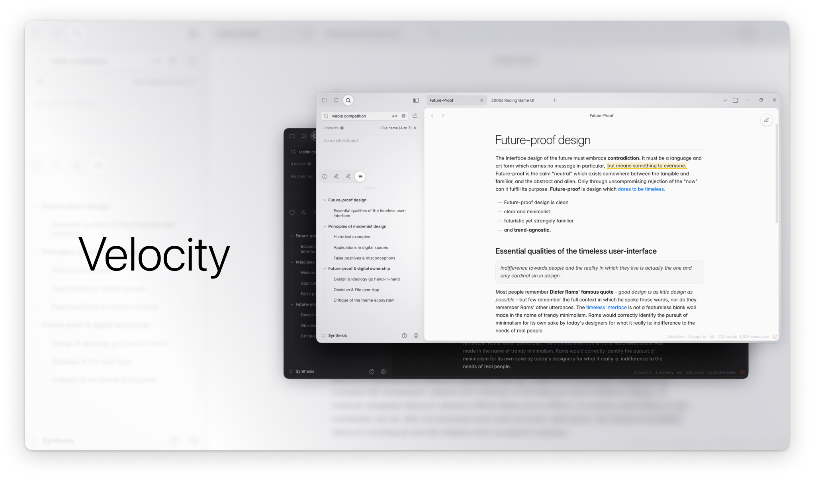
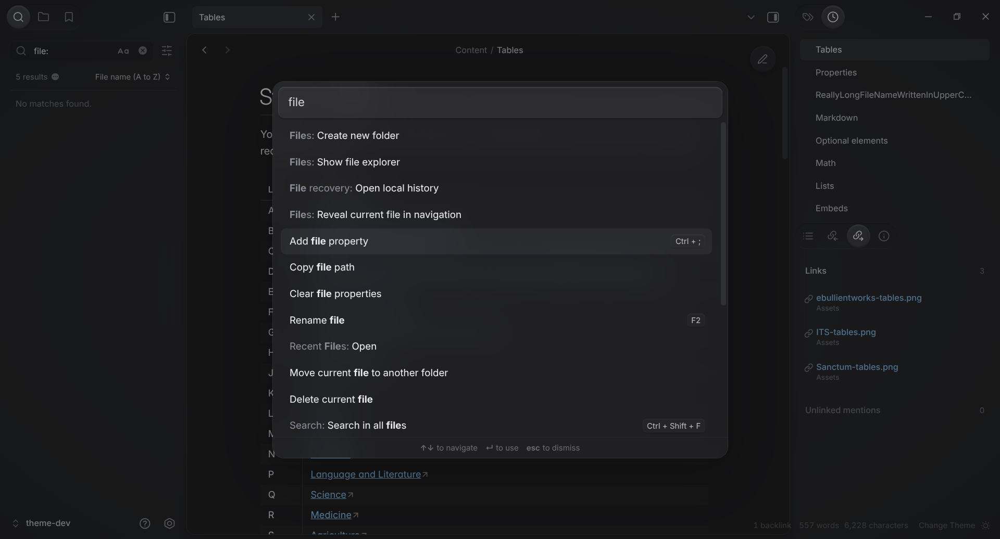

<h2 align="center">The theme of tomorrow, in your hands today.</h2>

Velocity is a sleek and futuristic theme for [Obsidian](https://obsidian.md)—born out of a relentless, one-year-long pursuit of design perfection. See for yourself what it's like to use a truly _next-generation theme_, and take your note-taking experience to a whole new level.      
 

Check out the **News** section of this README for the latest updates and announcements.

 

### Table of Contents

- [News](#News-)
- [FAQ](#FAQ-)
- [Features](#Features-)
- [Background](#Background-)
- [Credits](#Credits-)

 

 

## News [^](#Table-of-Contents)
As of 01/07/2026, **the latest release** is `Velocity 2.0.0`.

After over three months of continuous development since `1.3.0-beta`, 2.0.0 brings a **fresh new look** and massively refined user experience. Additionally, **full support** for phones and tablets is now available, ensuring all platforms get the same treatment and care.

Check out the [release page for 2.0.0](https://github.com/Gonzalo-D-Sales/obsidian-velocity/releases/tag/v2.0.0) for the full list of new features, improvements and fixes.

> [!CAUTION] 
> Velocity has been designed for and tested in the very latest insider versions of Obsidian, some of which have introduced breaking changes to the UI. Because Obsidian 1.13 has not yet released publicly, the **settings menu interface will be broken for many users.** However, other parts of the app should appear as usual.

 

## FAQ [^](#Table-of-Contents)
- **How can I customize the theme?**
  - Download the **Style Settings** plugin from within the Obsidian app's plugin store. The plugin is free and the settings for Velocity should appear automatically so long as you have the theme enabled.
  - Choose the **Quick Settings** to easily change layout and colors.
  - Choose the **Configurator** to dive deeper into Velocity's features.
- **How can I change the font / why are my custom fonts not working?**
  - Go to the **Quick Settings**, and enable the toggle to **"Override dedicated theme typeface".**
  - Velocity has been designed and tweaked around the font it is bundled with. It is highly encouraged to first experience Velocity the way it is meant to look before changing the font, which may introduce visual bugs and imperfections.
- **What kind of user is this theme designed for?**
  - Velocity is designed for creatives, thinkers and note-takers of all kinds. If you want your vault to look premium and polished, like it's straight out of a native macOS app, then Velocity can do just that (and so much more!) 
- **How long have you been working on this?**
  - Around **one year and two months**, as of the release of `2.0.0`.
- **Will you add _____ feature to Velocity?**
  - Features are added on a case-by-case basis. Certain popular features, such as _rainbow folders and headings_, have been **intentionally left out** because they conflict with Velocity's visual identity. 
  - Please make requests for features in the GitHub **Issues** tab, or in the Obsidian **Discord** thread for Velocity.
- **Will this theme break or interfere with plugins?**
  - Velocity **may interfere with the styling of some plugins' settings** or menus in a way that is not intended or aesthetic. This is a necessary tradeoff when designing a theme which makes significant alterations to the user interface.
  - Testing has shown that most plugins work normally with Velocity. The worst issues you may experience are minor visual bugs or misaligned elements, but plugin functionality should be **unaffected.**
- **Why does it look so much like the _____ theme?**
  - Velocity has been created with multiple inspirations in mind, including various themes I have used for my own vaults in the past. 
  - The most apparent similarities are with **[Cupertino](https://github.com/aaaaalexis/obsidian-cupertino)**. However, Velocity differs from Cupertino in many ways once you look past the surface level. Ultimately, the two themes are fundamentally different in approach and philosophy.
  - The keen-eyed may notice some parallels with the beautifully tactile **[Primary](https://github.com/primary-theme/obsidian)** by Cecilia May. 
  - The full list of works which have inspired Velocity are listed in the Credits section of the README. **Any other resemblances are purely coincidental.**

 

## Features [^](#Table-of-Contents)

### CSSClasses

Velocity comes with a set of **CSSclasses** which can be used to alter the styling of elements on a note-by-note basis:

| Name                  | Function                                                   |
| :-------------------- | :----------------------------------------------------------|
| `override`            | Quick utility to disable any other cssclasses in the note. |
| `hide-metadata`       | Hides any properties visible in the note.                  |
| `hide-title`          | Hides the inline-title for that particular note.           |
| `show-title`          | Shows the inline-title for that particular note.           |
| `style-justify` / `justified` | Justifies paragraph, blockquote and callout text.  |
| `style-margin-top`    | Adds additional padding to the top of the note.            |
| `style-wide`  | Sets maximum note width, equivalent to disabling readable width.   |
| `large-heading`        | Turns editor H1 into a larger heading.         |
| `super-heading`          | Like `large-heading`, but with bolder type and no underline. |
| `simple-title`        | Gives the inline title the standard heading style.         |

 

### Auto-Hide

Velocity comes with a novel feature first pioneered in **[Micro Mike](https://github.com/ThisTheThe/MicroMike)**: the ability to automatically hide the sidebars whenever the window's width is too narrow. This prevents the main panel from becoming too cramped or unreadable.

**Auto-Hide can be disabled** in the theme's Style Settings.

 

### Math Callouts

Velocity provides an alternative callout style inspired by the outlined look seen in most mathematics textbooks. To use a math callout, **manually set the callout type** to ``> [!math]``. To change the color, **append a dash followed by the color name;** for example, ``> [!math-red]``. 

Valid colors include all the default rainbow colors included in Obsidian by default, from `red` to `pink`.

 

### Planned Features

- [x] Several color schemes for light and dark mode
- [x] Full support for mobile devices
- [ ] Partial implementation of Damian Korcz's **[Alternative Checkboxes](github.com/damiankorcz/Alternative-Checkboxes-Reference-Set)** reference set

 

## Background [^](#Table-of-Contents)

Velocity draws heavy inspiration from **Apple's design principles and contemporary web aesthetics**. It evokes a clean, yet playfully mechanical, almost tactile kind of modernity. In addition, the theme aims to evoke - even if only subconsciously - the sleek user interfaces of various mid-to-late-2000s **racing games**. 

 

## Credits [^](#Table-of-Contents)

#### Themes:

**[Sanctum](https://github.com/jdanielmourao/obsidian-sanctum)** - the main theme I used in the past and a major influence on Velocity's typography, as well as its choice of icon modifications. 

**[Border](https://github.com/Akifyss/obsidian-border), [Mado](https://github.com/hydescarf/Obsidian-Theme-Mado-Miniflow), [Composer](https://github.com/vran-dev/obsidian-composer)** - major influences and sources of code for earlier versions of Velocity. While no Mado or Border, or Composer code remains in Velocity, I wouldn't have managed to get the theme to this state without learning from their example.

**[Primary](https://github.com/primary-theme/obsidian)** - Primary informs this theme's perfectionism, its synthesis of traditional modernist movements and new aesthetic subcultures, and my approach to never leave any detail untouched.

**[Cupertino](https://github.com/aaaaalexis/obsidian-cupertino)** - A modern and influential macOS-inspired theme. Velocity's interaction design and overall layout is strongly inspired by this theme. 

**[Willemstad](https://github.com/tingmelvin/willemstad-x)** - a source of inspiration for the modified community themes page in both old and new versions of Velocity. 

**[Micro Mike](https://github.com/ThisTheThe/MicroMike)** - its "mini-mode" is the basis for Velocity's Auto-hide feature.

**[Maple](https://github.com/subframe7536/obsidian-theme-maple)** - Velocity takes inspiration from Maple's unique document search styling.

**[CreArts](https://github.com/CreArts-Community/CreArts-Obsidian)** - The idea of adding a preview image for each of Velocity's paint schemes originally came from this theme.

### People:

Under construction...
