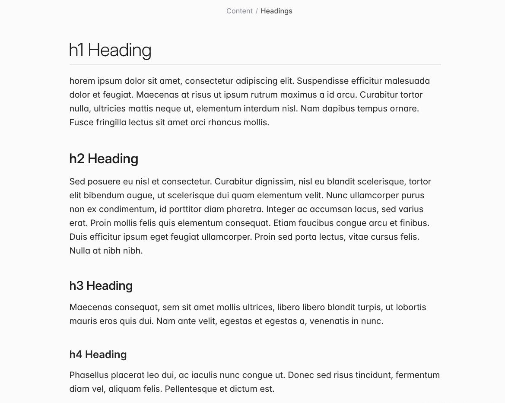

<h2 align="center">The theme of tomorrow, in your hands today.</h2>

Velocity is a sleek and futuristic theme for [Obsidian](https://obsidian.md)—born out of a relentless, one-year-long pursuit of design perfection. See for yourself what it's like to use a truly _next-generation theme_, and take your note-taking experience to a whole new level.    

 

### Table of Contents

- [Updates](#Installation-)
- [FAQ](#FAQ-)
- [Features](#Features-)
- [Background](#Background-)
- [Credits](#Credits-)

 

## Updates [^](#Table-of-Contents)
As of 01/07/2026, **the latest release** is `Velocity 2.0.0`.

After over three months of continuous development since `1.3.0-beta`, 2.0.0 brings a **fresh new look** and massively refined user experience. Additionally, **full support** for phones and tablets is now available, ensuring all platforms get the same treatment and care.

Check out the [release page for 2.0.0](https://github.com/Gonzalo-D-Sales/obsidian-velocity/releases/tag/v2.0.0) for the full list of new features, improvements and fixes.

## FAQ [^](#Table-of-Contents)
- **Do I have to buy Velocity?**
  - No. The theme is free, as it should be.
- **What kind of user is this theme designed for?**
  - Velocity is designed for creatives, thinkers and note-takers of all kinds. If you want your vault to look premium and polished, like it's straight out of a native macOS app, then Velocity can do just that (and so much more!) 
- **How can I customize the theme?**
  - Download the **Style Settings** plugin from within the Obsidian app's plugin store. The plugin is free and the settings for Velocity should appear automatically so long as you have the theme enabled.
  - Choose the Quick Settings to easily change layout and colors.
  - Choose the Configurator to dive deeper into Velocity's features.
- **Where can I find the documentation?**
  - Docs are WIP and not a priority at the moment. 
- **How long have you been working on this?**
  - Around **one year and two months**, as of the release of `2.0.0`.
- **Will you add feature X/Y/Z to Velocity?**
  - It depends. Certain features you may be looking for might already be present in the theme. Others which are missing may be added or rejected based on whether the feature is aligned with Velocity's overall philosophy, or whether the feature is better off as some snippet instead. In any case, please make requests for features in the **Issues** page or in the Obsidian **Discord** thread for Velocity.
- **Will this theme work with plugin X/Y/Z?**
  - As an opinionated UI-centric theme, Velocity **may interfere with the styling of some plugins' settings** or modals in a way that is not intended or aesthetic. This is a necessary and inevitable tradeoff when designing a theme which alters the default UI to such an extent. Nevertheless, in my own testing, most plugins work just fine with Velocity. The worst you'll experience in most cases is some minor menu jank, but the actual functionality of plugins should be **totally unaffected.**
- **Why does it look so much like theme X/Y/Z?**
  - Velocity has been created with multiple inspirations in mind, including various themes I have used for my own vaults in the past. 
  - The most apparent similarities are with **[Cupertino](https://github.com/aaaaalexis/obsidian-cupertino)**. However, Velocity differs from Cupertino in many ways once you look past the surface level. Ultimately, the two themes are fundamentally different in approach and philosophy.
  - The keen-eyed may notice some parallels with the beautifully tactile **[Primary](https://github.com/primary-theme/obsidian)** by Cecilia May. This is because I have taken much inspiration from her exacting attention to detail and focus on tactile responsiveness in UI interactions. 
  - I have detailed the full list of works I have drawn inspiration from in the Credits section of the README. **Any other resemblances are thus purely coincidental.**

## Features [^](#Table-of-Contents)

### CSSClasses

Velocity comes with a set of **CSSclasses** which can be used to alter the styling of elements on a note-by-note basis:

| Name                  | Function                                                   |
| :-------------------- | :----------------------------------------------------------|
| `override`            | Quick utility to disable any other cssclasses in the note. |
| `hide-metadata`       | Hides any properties visible in the note.                  |
| `hide-title`          | Hides the inline-title for that particular note.           |
| `show-title`          | Shows the inline-title for that particular note.           |
| `style-justify` / `justified` | Justifies paragraph, blockquote and callout text.  |
| `style-margin-top`    | Adds additional padding to the top of the note.            |
| `style-wide`  | Sets maximum note width, equivalent to disabling readable width.   |
| `large-heading`        | Turns editor H1 into a larger heading.         |
| `super-heading`          | Like `large-heading`, but with bolder type and no underline. |
| `simple-title`        | Gives the inline title the standard heading style.         |

### Auto-Hide

Velocity comes with a novel feature first pioneered in **[Micro Mike](https://github.com/ThisTheThe/MicroMike)**: the ability to automatically hide the sidebars whenever the window's width is too narrow. This prevents the main panel from becoming too cramped or unreadable.

**Auto-Hide can be disabled** in the theme's Style Settings.

### Planned features:

- Partial implementation of Damian Korcz's **[Alternative Checkboxes](github.com/damiankorcz/Alternative-Checkboxes-Reference-Set)** reference set

## Background [^](#Table-of-Contents)

Velocity draws heavy inspiration from **Apple's design principles and contemporary web aesthetics**. It evokes a clean, yet playfully mechanical, almost tactile kind of modernity. In addition, the theme aims to evoke - even if only subconsciously - the sleek user interfaces of various mid-to-late-2000s **racing games**. 

## Credits [^](#Table-of-Contents)

#### Themes:

**[Sanctum](https://github.com/jdanielmourao/obsidian-sanctum)** - the main theme I used in the past and a major influence on Velocity's typography, as well as its choice of icon modifications. 

**[Border](https://github.com/Akifyss/obsidian-border), [Mado](https://github.com/hydescarf/Obsidian-Theme-Mado-Miniflow), [Composer](https://github.com/vran-dev/obsidian-composer)** - major influences and sources of code for earlier versions of Velocity. While no Mado or Border, or Composer code remains in Velocity, I wouldn't have managed to get the theme to this state without learning from their example.

**[Primary](https://github.com/primary-theme/obsidian)** - Primary informs this theme's perfectionism, its synthesis of traditional modernist movements and new aesthetic subcultures, and my approach to never leave any detail untouched.

**[Cupertino](https://github.com/aaaaalexis/obsidian-cupertino)** - A modern and influential macOS-inspired theme. Velocity's interaction design and overall layout is strongly inspired by this theme. 

**[Willemstad](https://github.com/tingmelvin/willemstad-x)** - a source of inspiration for the modified community themes page in both old and new versions of Velocity. 

**[Micro Mike](https://github.com/ThisTheThe/MicroMike)** - its "mini-mode" is the basis for Velocity's Auto-hide feature.

**[Maple](https://github.com/subframe7536/obsidian-theme-maple)** - Velocity takes inspiration from Maple's unique document search styling.

**[CreArts](https://github.com/CreArts-Community/CreArts-Obsidian)** - The idea of adding a preview image for each of Velocity's paint schemes originally came from this theme.

### People:

Under construction...
